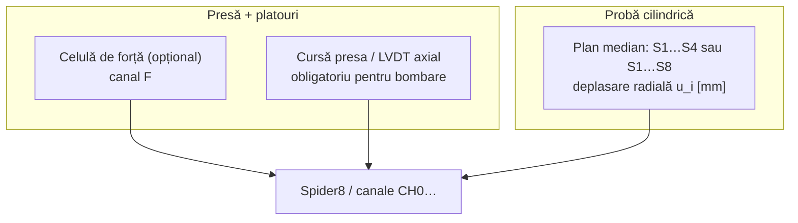
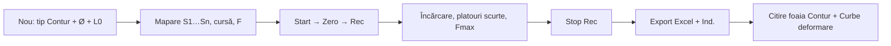

# Compresiune cilindru – contur

## Manual de laborator — UPET AcqLab / Spider8DAQ

**Universitatea din Petroșani**  
**Facultatea de Inginerie Mecanică și Electrică**  
**Departamentul de Inginerie Mecanică, Industrială și Transporturi**  
Software: **UPET AcqLab**  
Tip experiment (etichetă exactă în aplicație): **Compresiune cilindru – contur**

Acest manual descrie **ce se măsoară**, **de ce**, **cum se configurează** și **cum se citește raportul** (Excel, HTML, PDF industrial). Textul urmează etichetele, foile, graficele și formulele din software, nu o procedură generică de rezistența materialelor.

---

## Cuprins

1. [Scopul experimentului](#1-scopul-experimentului)
2. [Pregătire și montaj](#2-pregătire-și-montaj)
3. [Derulare măsurare](#3-derulare-măsurare)
4. [Funcții evidențiate (pas cu pas)](#4-funcții-evidențiate-pas-cu-pas)
5. [Raportul — foaie cu foaie, grafic cu grafic](#5-raportul--foaie-cu-foaie-grafic-cu-grafic)
6. [Formule și mărimi](#6-formule-și-mărimi)
7. [Limitări](#7-limitări)
8. [Glosar](#8-glosar)

---

## 1. Scopul experimentului

### 1.1. Ce se urmărește

Pe o **probă cilindrică** (sau tub) se aplică **compresiune axială** între platourile presei. Senzorii de deplasare așezați **pe circumferință, la mijlocul înălțimii**, măsoară umflarea radială `u_i` [mm] în mai multe direcții.

La **forța maximă (Fmax)** — sau la un index echivalent, dacă forța lipsește — programul reconstruiește:

- **conturul radial** (vedere de sus / plan): cercul nedeformat `R0` și inelul deformat la Fmax;
- **profilul de bombare** (elevație): platourile rămân aproape de diametrul inițial, mijlocul se umflă;
- **secțiunea** (jumătate de cilindru, solid sau tub);
- **ovalitatea** (diferența dintre cea mai mare și cea mai mică umflare);
- **indexul de bombare** (cât de mult se umflă radial față de cât se scurtează axial).

Termenul din raport și din Asistent (LabAdvisor) este **bombare**, nu „bariling”. În codul intern apare și `barreling`; în laborator folosiți **bombare**.

### 1.2. De ce se face în laborator (context UPET)

În laboratorul de materiale / presă, un cilindru comprimat **nu rămâne un cilindru perfect**: frecarea pe platouri împiedică alunecarea la capete, iar mijlocul se umflă. Conturul la Fmax arată:

- dacă deformația e **simetrică** sau **ovală** (un senzor crește mult, altul puțin);
- dacă un senzor **nu lucrează** (semnal plat);
- raportul dintre **umflare radială** și **cursă axială** (index de bombare);
- diametrele **D_capat** (la platouri) și **D_mijloc** (la mijlocul înălțimii).

Acestea sunt mărimi de **geometrie a deformației**, nu un scan 3D al suprafeței. Harta colorată de pe elevație este un **model** (vezi cap. 6 și 7).

### 1.3. Ce este și ce nu este acest tip

| Este | Nu este |
|------|---------|
| Compresiune cu **contur circumferențial** la Fmax | Tensometrie cu mărci (`Mărci tensometrice`) |
| Raport cu foile **Contur** și **Curbe deformare** | Foaie dedicată Poisson `ν` sau „Timbru” |
| 4 sau 8 senzori radiali + **cursă presa** | Scan dens pe înălțime (doar un model `sin^2`) |
| Opțional: canal de **forță** | Metrologie pe trepte (export separat, vezi 5.12) |

Dacă la **Tip experiment** alegeți altceva (de exemplu `Mărci tensometrice` sau `Forță / Celule de sarcină`), expanderul **Contur cilindru** dispare și raportul **nu** include foaia Contur — chiar dacă a rămas un `ContourConfig` vechi în proiect.

---

## 2. Pregătire și montaj

### 2.1. Schema fizică (ce se leagă)



- **Platourile** (sus și jos) țin capetele probei. În desenul de raport apar ca bare groase orizontale; săgețile **F** indică compresiunea.
- **Senzorii S1…Sn** stau pe **circumferință, la mijlocul înălțimii**. Valoarea canalului, după Scale, este tratată ca **deplasare radială `u` [mm]**: pozitiv = umflare în afară.
- **Cursă presa** este deplasarea axială [mm] (scurtare). Semnul nu contează în formule: se folosește `|cursă|`.
- **Forța** este opțională, dar **recomandată**: fără ea, indexul conturului nu mai e „ArgMax |F|”, ci un fallback (cap. 6.2).

Unghiurile sunt față de **axa +X în vedere de sus**. Implicit:

- **4 senzori:** 0°, 90°, 180°, 270°
- **8 senzori:** 0°, 45°, 90°, …, 315°

`S1` este tratat în legendă ca **referință / față** a probei.

### 2.2. Canale în grila **Canale DAQ**

Trei bifări distincte (nu le confundați):

| Coloană | Semnificație |
|---------|----------------|
| **On** | Canalul intră în achiziție live |
| **Graf** | Canalul apare pe Y(t) live |
| **Rec** | Canalul se scrie în CSV la Record |

Pentru contur, **S1…Sn, cursa și (dacă există) forța trebuie să aibă Rec**. Maparea din Start experiment se face pe indici **0-based**: eticheta `CH0` = index 0. Dacă în CSV rămân doar 4 coloane, nu puteți avea 4 senzori + cursă distinctă.

Unități așteptate:

- senzori radiali și cursă: **mm** (nume canal cu `[mm]`, sau cuvinte `cursă` / `deplasare`);
- forță: **N** (sau `kN` / `lbf` la mapare automată). Pentru curba `sigma vs eps`, programul tratează forța ca **N** și aria ca **mm²** → rezultat în **MPa**. Dacă celula e în kN, Scale-ul canalului trebuie să aducă valoarea la newtoni.

### 2.3. Start experiment — ce completați (fereastra **Nou**)

Ribbon: grup **EXPERIMENT** → **Nou** (tooltip: „Experiment nou”).

Ordinea din fereastră:

1. **Sample / Probă**
2. **Tip experiment** → alegeți exact **Compresiune cilindru – contur**  
   (variantele cu cratimă `/` en-dash sunt acceptate la recunoaștere, dar în listă apare en-dash.)
3. Apare expanderul **Contur cilindru** (ascuns la celelalte tipuri).
4. **Dimensiuni / greutate (Ø necesar contur)**

Mesajul albastru de sub tip:

> Tip contur: completați Ø (diametru) — necesar pentru R₀ — și maparea senzorilor circumferențiali mai jos.

#### Dimensiuni

| Câmp UI | Obligatoriu? | Rol în contur |
|---------|--------------|----------------|
| **Diametru Ø [mm]** ★ | **Da** | `R0 = Ø / 2`. Fără Ø, graficul Contur nu se generează. |
| **Lungime [mm]** | Recomandat | `L0` pe înălțime (harta de bombare). |
| **Grosime [mm]** | Fallback | Dacă lungimea e 0, `L0` se ia din grosime/înălțime. |
| **Lățime [mm]** | Nu pentru cilindru | Folosit la prisme (aria); nu intră în geometria de bombare. |
| **Greutate [g]** | Opțional | Doar meta pe foaia Raport. |

Câmpul diametru se **evidențiază**: chenar albastru dacă Ø e completat, roșu dacă lipsește; eticheta devine `Diametru Ø [mm] ★ necesar`. Tooltip: „Obligatoriu pentru contur cilindru — R₀ = Ø/2”.

Dacă **L0 lipsește**, desenul de elevație folosește o lungime **nominală**: `max(2 * D0, 3 * |cursă|)` și notează sursa (`nominal 2*D0` sau `nominal 3*|cursa|`). Asistentul avertizează: harta de bombare are nevoie de L0 real.

**Diametrul interior (tub)** nu are câmp în Start experiment. Dacă e setat în meta/proiect (`SampleInnerDiameterMm` sau `InnerDiameterMm` în ContourConfig), secțiunea se desenează ca tub (`ID tub`); altfel: `ID = solid`.

#### Expander **Configurare contur (4/8 senzori, forță, cursă, unghiuri) — auto-map la tip Contur**

| Control | Ce face |
|---------|---------|
| **Senzori** (4 / 8) | Numărul de senzori circumferențiali |
| **Canal forță** (bifă + CH) | Opțional. Dacă e bifat, indexul contur = ArgMax \|F\| |
| **Cursă presa** | Canal obligatoriu pentru configurație validă și pentru bombare |
| **S# → canal · unghi [°]** | Fiecare `S1…Sn` pe un `CHn` și un unghi [°] față de +X (vedere de sus) |

La selectarea tipului Contur, aplicația face **mapare automată**: preferă canale **Rec** și **[mm]** pentru S1…Sn, apoi un canal mm rămas pentru cursă, apoi un canal de forță (N/kN). Rezumatul apare albastru, de forma:

`Mapare automată: S1→CH0@0° , S2→CH1@90° , … · cursă=CHn · F=CHm (Rec/[mm] preferat · unghiuri egale).`

Verificați maparea pe banc: auto-map-ul nu știe care LVDT e „fața” probei.

#### Restul ferestrei (comun tuturor experimentelor)

- **Preset vizualizare** — doar afișaj live, nu calculează conturul.
- **Locație / banc** — implicit `Lab UPET — presa / stand`.
- **Comentariu / obiectiv**
- **Rată [Hz]**
- **Poză/schiță montaj (înainte, opțional)** — buton **Cameră — montaj înainte…**, **Șterge foto**, observații.
- **Senzori planificați (Ctrl+click)** — librărie; la tip Contur lista **nu** e filtrată pe o categorie (spre deosebire de `Mărci tensometrice`).
- **Aplică senzorii selectați pe canalele Enabled (în ordine CH)** — bifat implicit.

### 2.4. Preset presă (opțional)

În expanderul **Mai multe unelte — Viz / Export / Ajutor / Dispozitiv**, grup **VIZ**: butonul cu tooltip **Preset Presă hidraulică UPET**. Ajută la vizualizare; **nu înlocuiește** maparea S1…Sn și Ø.

### 2.5. Checklist înainte de Record

1. Tip = **Compresiune cilindru – contur**.
2. **Ø** completat; **Lungime** completată dacă se poate.
3. S1…Sn, cursă (și forța) au **On** + **Rec**, Scale în mm / N.
4. **Zero** după montaj, înainte de încărcare (vezi cap. 4).
5. Unghiurile corespund poziției reale pe probă.

---

## 3. Derulare măsurare

### 3.1. Conectare și start

1. Grup **CONEXIUNE**: backend (Simulator / Serial / Spider32 / HBM USB), port, rată [Hz] → **Conn**.
2. **Nou** → completați Start experiment (cap. 2.3) → confirmați.
3. Grup **MĂSURARE**: **Start** (F5) — streaming live. **Stop** (F6) oprește streaming-ul, nu CSV-ul.

### 3.2. Zero, Record, Stop Rec

| Buton | Shortcut | Ce face |
|-------|----------|---------|
| **Zero** | F9 | Tare / zero pe canale (tooltip: Zero all) |
| **Rec** (ribbon) | F7 | Pornește înregistrarea CSV |
| **Stop Rec** | F8 | Închide CSV-ul |

**Rec din ribbon ≠ Rec din grila de canale.** Primul pornește fișierul; al doilea decide ce coloane se scriu.

Asistentul recomandă lanțul: **Connect → Apply senzor → Start → Zero → Record**. CSV-ul e complet independent de exportul care poate rula în fundal.

### 3.3. Ce se înregistrează (CSV vs raport)

- **CSV** (folder `recordings`): **toate eșantioanele** de pe canalele cu Rec, plus comentarii de meta (`ExperimentType=…`, `SampleDiameterMm=…`, `ContourConfig={json}`). Acesta e livrabilul brut.
- **Raportul Excel/HTML/PDF** este un **rezumat + grafice**: statistici, schemă Contur la **un singur index** (Fmax), curbe u_i (posibil decimate pentru desen), CWT, etc. Nu înlocuiește CSV-ul.

Dacă înregistrarea are peste **1 048 575** eșantioane, foaia Excel **Date** taie la limita Excel și trimite la CSV pentru rest.

### 3.4. MARK (marcaj în CSV)

În expanderul de unelte, grup **DISPOZITIV**: marcaj CSV în timpul Record (**Ctrl+Shift+M**). În graficul live există bifa **Linie MARK**.

MARK **nu** alege indexul conturului. Conturul se ia la Fmax (sau fallback). MARK servește foii opționale **Peak la MARK**: valoarea la timestamp-ul marcajului și peak-ul în fereastra **±5 eșantioane**.

### 3.5. Cursor A / Cursor B

În analiză, o zonă A–B (nu tot span-ul) este „zonă de validitate”. Pentru contur, Cursor B se folosește **doar dacă nu există canal de forță**. Cu forță configurată, indexul rămâne ArgMax |F| pe toată înregistrarea (sau pe sesiunea trimisă la calcul).

### 3.6. Stop și export

După Fmax și o descărcare scurtă: **Stop Rec**, apoi **Stop** dacă ați terminat streaming-ul. Export: grup **EXPORT** (Excel, HTML, PDF, **Ind.** = raport industrial, pachet laborator). Asistentul: „Exportul poate rula în fundal; CSV-ul e complet.”

Recomandare de la Asistent pentru acest tip: **platouri scurte înainte de Fmax**; **nu schimbați layout-ul graficelor live** în timpul încercării; conturul se ia la Fmax.

---

## 4. Funcții evidențiate (pas cu pas)

„Evidențiate” înseamnă aici: (a) câmpurile pe care UI le **subliniază** la acest tip, (b) butoanele cu **Info** (hover), (c) mesajele Asistentului, (d) analiza de contur din raport.

Activați **Info** (grup **AJUTOR**, tooltip: „Ajutor contextual pe butoane (hover)”) ca textele de mai jos să apară și în panoul de ajutor.

### 4.1. Diametru Ø — ce măsoară / de ce e marcat

- **Mărime:** diametrul inițial al probei [mm], măsurat cu șublerul **înainte** de încercare.
- **De ce:** `R0 = Ø/2` e cercul nedeformat. Fără R0 nu există plan, elevație, ovalitate în mm reali.
- **Unde:** Start experiment, evidențiat; Asistent: „Lipsește Ø”.
- **În raport:** `R0` pe desen, `Diametru [mm]` pe Raport, `D = … mm` pe plan.

### 4.2. Lungime L0

- **Mărime:** înălțimea inițială a cilindrului [mm].
- **De ce:** scara verticală a hărții de bombare și `ε = |cursă| / L0`.
- **Asistent:** „Completați lungimea L0 a probei — harta de bombare folosește L0 pe înălțime.”

### 4.3. Mapare S1…Sn, unghiuri, cursă, forță

- **Măsoară:** `u_i(t)` [mm] la unghiul `θ_i`; cursa axială; opțional F.
- **De ce:** ovalitatea la Fmax e greșită dacă un S# e pe canalul greșit sau unghiul e inversat.
- **Asistent:** expander Contur → unghiuri 0°/90°… sau 0°/45°… → cursă + forță pe canale Rec.

### 4.4. **On / Graf / Rec** pe canal

Vezi 2.2. Conturul din CSV folosește **coloanele Rec**, nu doar ce e pe ecran.

### 4.5. **Start / Stop / Rec / Stop Rec / Zero**

Vezi 3.2. Zero-ul definește `u = 0` la starea nedeformată (sau la starea de după contactul platourilor — notați în comentariu ce ați zerat).

### 4.6. **MARK** (Ctrl+Shift+M)

Marchează un eveniment (ex. început descărcare). Nu mută Fmax. Apare în **Peak la MARK** dacă CSV-ul conține liniile MARK.

### 4.7. **Export Excel** (tooltip: „Export Excel + grafice pe canale”)

Generează `.xlsx` cu foile din cap. 5. Pentru acest tip, **Contur** e foaia 2, **Curbe deformare** foaia 3.

### 4.8. **Export HTML**

Același pachet de grafice: schema Contur **prima** dintre imagini, apoi curbele de deformare, overview, Y(t), CWT. Indicatorii de contur pot apărea și în blocul industrial de rezultate.

### 4.9. **PDF** vs **Ind.** (raport industrial)

| Export | Contur în document? |
|--------|---------------------|
| **PDF** (cu preview) | Pagini CWT / Y(t); **nu** are capitol Contur dedicat în exportul compact |
| **Ind.** | Pagină dedicată **Contur cilindru — plan + elevatie + sectiune** + pagini **Curbe deformare**; tabelul de rezultate include rândurile Contur |

Pentru predare de laborator a acestui experiment, folosiți **Excel** și/sau **Ind.**, nu doar PDF-ul compact.

### 4.10. **.upet / Pachet / Open**

- **.upet** — raport binar, se deschide doar în UPET AcqLab.
- **Pachet** — ZIP sau `.upetlab`: README + CSV + poze + .upet + Excel/HTML.
- Nu schimbă formulele; împachetează aceleași rezultate.

### 4.11. **Asistent** (LabAdvisor) — mesaje specifice conturului

| Id (intern) | Titlu UI | Când | Ce înseamnă |
|-------------|----------|------|-------------|
| ctx-contour-diameter | Lipsește Ø | Ø ≤ 0 | Fără R0 nu există schemă |
| ctx-contour-l0 | Lipsește L0 | lungime ≤ 0 | Harta pe înălțime e schematică |
| ctx-contour-map | Mapare S1…Sn / unghiuri | mapping incomplet | Ovalitate greșită |
| ctx-contour-flat-radial | Senzor radial plat | un S# aproape constant, ceilalți cresc | Cablu / senzor defect |
| ctx-contour-result | Contur la Fmax | sesiune calculată | Ovalitate, u_max, bombare — „Schema e în raportul Contur (plan + hartă bombare)” |
| ctx-contour-fmax | Platouri și Fmax | live / întrebare | Platouri scurte; index la Fmax |
| peer-compare | Comparație cu testul Contur anterior | există CSV-uri de același tip | Delta ovalitate, bombare, u_med, u_max, Fmax |
| peer-none | Fără test anterior de același tip | primul test Contur din `recordings` | Nu se compară cu tensometrie |

La tensometrie, Asistentul **ascunde** aceste reguli și spune explicit că raportul **nu** include foaia Contur.

### 4.12. **Grafic Morlet / CWT** live

Comută afișajul live pe scalogramă Morlet. În **raport**, CWT se calculează **offline pe toată durata**, pe fiecare canal activ — independent de fereastra live.

### 4.13. **Cursor A–B / FFT / CWT pe segment**

Analiză pe zonă. Pentru indexul Contur, vezi 3.5: forța are prioritate față de Cursor B.

### 4.14. **Export Excel metrologie**

Panou separat (trepte, liniaritate, histerezis). **Nu** este o foaie din raportul de compresiune cilindru. Nu confundați cu foaia Contur.

### 4.15. Poisson (ν) pe graficul live

Mod de afișaj `Poisson (ν)` — pentru mărci tensometrice. Pe tipul Contur, `ν` **nu** se calculează din u_i. Dacă totuși există un rezumat Poisson în meta, poate apărea ca rând opțional pe Raport; nu e o foaie „Poisson”.

---

## 5. Raportul — foaie cu foaie, grafic cu grafic

### 5.0. Ce conține un raport **Compresiune cilindru – contur**

Ordinea foilor Excel (când există date):

1. **Raport** (întotdeauna, prima)
2. **Contur** (întotdeauna încercată la acest tip)
3. **Curbe deformare** (la acest tip)
4. **Montaj** — doar dacă există poză înainte și/sau după
5. **Canale** — doar dacă meta are lista de canale
6. **Peak la MARK** — doar dacă CSV-ul are marcaje MARK
7. **Grafic** — overview pe unitate
8. **Date** — eșantioane
9. **Grafice canale** + **câte o foaie pe canal** (numele canalului, max. 31 caractere)
10. **CWT** — dacă s-au putut genera scalograme

**Nu apar** în acest raport: foaie „Metrologie”, foaie „Tensometrie”, foaie „Poisson”, overlay mid-load 50% F (dezactivat implicit în renderer).

Lângă `.xlsx` se pot salva PNG-urile într-un folder `*_grafice`. HTML face la fel.

---

### 5.1. Foaia **Raport**

**Scop:** copertă — cine, ce, când, statistici, cuprinsul celorlalte foi.

Antet: logo UPET, Universitatea din Petroșani, expert, autor soft. Titlu: **UPET AcqLab — Raport măsurătoare**.

#### 1. Identificare experiment (perechi etichetă / valoare)

Rândurile goale se omit, cu excepția celor forțate. Relevante pentru contur:

| Etichetă | Conținut |
|----------|----------|
| Instituție | Universitatea din Petroșani |
| Autor soft | drd. ing. Iucal Ilie |
| Proiect, Operator, Sample / Probă | din Start experiment |
| Lungime / Lățime / Grosime / Diametru [mm], Aria secțiune [mm²], Greutate [g], Dimensiuni / greutate | doar dacă > 0 |
| ν aparent (Poisson), Poisson — detalii, recuperare | **doar dacă** au fost calculate în meta (nu din contur) |
| **Tip experiment** | `Compresiune cilindru – contur` |
| **Contur cilindru** | rezumat: `n senzori · F=CHx · cursă=CHy · R0=… mm` |
| Preset, Locație / banc, Comentariu / obiectiv | |
| Start / Stop experiment, Durată estimată [min] | |
| Timp înregistrare, Rată setată, Rată efectivă | `fs_ef` și `Δt_med` |
| Canale active, Senzori planificați, Senzori / canale, Calibrare / note | |
| Sursă CSV, Eșantioane, Canale semnal / coloane | |
| Poză montaj (înainte) / după | `Da — «Montaj»` sau `Nu (opțional)` |
| Observații montaj | |
| Stare dispozitiv (EST) | dacă e curat |
| Disclaimer, Zonă predare, Calitate, Semnătură, Amprentă, Stare amprentă | bloc industrial / amprentă măsurare |

#### 2. Statistici canale

Coloane: **Canal**, **N**, **Min**, **Max**, **Mean**, **P2P** (peak-to-peak), pe toată înregistrarea.

#### 3. Cuprins foi raport

Bullet-uri generate automat, de exemplu:

- «Raport» — identificare + statistici
- «Contur» — plan + elevație + secțiune + tabel uᵢ + mini F-cursă (+ nota de subsol)
- «Curbe deformare» — N grafice uᵢ vs timp / cursă / forță + tabel uᵢ la Fmax
- «Montaj» — dacă există foto
- «Canale» — dacă există lista
- «Grafic» — overview
- «Date» — eșantioane brute CSV
- «Grafice canale» + N foi pe canal (1000×500 în textul de cuprins; PNG-ul sursă e 1600 px lățime, scalat la afișare)
- «CWT» — scalograme timp-frecvență (toată durata)

Jos: lista **Canale active**.

---

### 5.2. Foaia **Contur** (nucleul raportului)

**Titlu foaie:** `Contur cilindru — plan + elevație + secțiune (R0 + Contur Fmax · S1…Sn · u_i)`

**Notă de subsol** (italic): schema industrială + onestitatea hărții:

> Harta bombare: u din senzori (plan median). Pe inaltime: model platouri u~0, mijloc = masurat.

**Rând Status:**

- verde: `OK — grafic Contur inclus (plan + elevație + secțiune)`
- portocaliu: motivul omiterii (Ø, mapping, tip greșit, sesiune goală, etc.)

#### Tabel Indicator / Valoare

Generat din calcul (etichete exacte):

| Indicator | Ce înseamnă |
|-----------|-------------|
| Contur cilindru | `idx=… · R0=… mm · n senzori` |
| Ovalitate [mm] | `max(u) − min(u) = max(R) − min(R)` la Fmax |
| u_max [mm] | cea mai mare deplasare radială |
| u_min [mm] | cea mai mică |
| u_med [mm] | media aritmetică a u_i |
| L0 [mm] | lungime inițială (+ notă dacă e nominală) |
| L la Fmax [mm] | `L0 − |cursă|` |
| R interior [mm] | dacă e tub |
| Index de bombare [-] | `u_med / |cursă|` (sau „— (fără \|cursă\| / \|u_axial\| ≠ 0 la index)”) |
| Direcție u_max | `S# @ θ°` |
| u_S# [mm] (CHn, θ°) | fiecare senzor |
| Avertisment senzor | dacă un canal e plat |
| Index Fmax / contur | regula folosită (vezi 6.2) |

Apoi imaginea PNG **2400×1600**, afișată la ~1100 px lățime.

---

### 5.3. Cum se citește figura industrială Contur

O singură imagine, ca o planșă de desen tehnic. **Cifrele reale sunt în tabelul din stânga**; pe vederi nu sunt cutii cu u_i (ca să nu se suprapună).

Titlul planșei (ASCII, fără diacritice pe desen):  
`Contur cilindru - plan + elevatie + sectiune`

Legendă linie (sub vederi):

`--  R0 / L0 nedeformat    - - Contur / profil la Fmax    /// perete (sectiune)    |   directie u_max`

Culori:

- **negru** — nedeformat (cerc R0, dreptunghi L0×D0, platouri);
- **albastru oțel `#2B5F8A`** — Contur / profil la Fmax, linie **întreruptă**;
- **harta Turbo** — umplere bombare (vezi paletă).

Dacă |u| e foarte mic față de R0, inelul Fmax e **mărit vizual** (~2–8% din R0) ca să se vadă; tabelul spune `Contur marit vizual xK` sau `Contur la scara reala`. Valorile din tabel **nu** sunt mărite.

#### A. Tabelul din stânga — **Tabel u_i** (legendă)

Font monospațiat. Coloane: `S#`, `deg`, `u [mm]`. Senzorul cu u_max are `*`.

Apoi: `u_max`, `u_min`, `u_med`, `ovalitate`, `bombare`, `idx Fmax`, `cursa`, `F`, `L0`, `L`, `dL`, `D_capat`, `D_mijloc`, `A0` [mm2], `ID` (solid sau mm), `load:` (`sigma vs eps` / `F vs cursa` / …).

Note:

- `plan + elevatie + sectiune`
- `Harta bombare: u din senzori (plan median).`
- `Pe inaltime: model platouri u~0, mijloc = masurat.`
- `S1 = referinta / fata`
- sursa L0 și tipul secțiunii
- scara vizuală a conturului
- `(valori reale in tabel)`

Textul e **ASCII-safe**: fără subscrise, fără ° (scrie `deg`), fără liniuțe tipografice — ca să nu apară pătrate goale („tofu”) în fontul de desen.

#### B. **Fig. Contur radial** (plan, vedere de sus)

| Element | Cum se citește |
|---------|----------------|
| Cerc negru | R0 nedeformat |
| Inel albastru întrerupt | contur neted prin vârfurile senzorilor la Fmax (interpolare polară, nu coarde drepte) |
| Cruce în centru | origine |
| Cotă **D = … mm** | diametru inițial = 2 R0 |
| Cotă **R0 = … mm** | rază, spre stânga (180°) |
| Cercuri goale pe R0 + etichete **S1…Sn** | poziții unghiulare |
| Punct albastru la vârf | capătul vizual al u_i (poate fi exagerat) |
| Linie subțire **\|** | direcția u_max (fără săgeată groasă) |

**Bine:** inelul Fmax e în **afara** lui R0 (u > 0, bombare); S-urile au u de același ordin.  
**Problematic:** un S# cu u≈0 și ceilalți mari (senzor plat); inel foarte oval (montaj excentric, frecare neuniformă, sau unghiuri greșite); inel **în interiorul** lui R0 (u negativ — polaritate Scale, sau Zero după umflare).

Overlay-ul la ~50% Fmax există în motor, dar **nu se desenează implicit** (`ShowMidLoadContour = false`).

#### C. **Fig. Elevatie - harta bombare**

Vedere laterală în planul u_max (dreapta = senzorul de u_max, stânga = ~180° față de el — de aceea stânga/dreapta pot diferi = ovalitate).

| Element | Citire |
|---------|--------|
| Dreptunghi negru | nedeformat: lățime 2 R0, înălțime L0; Y=0 = platou jos |
| Siluetă albastră întreruptă | profil bombat la Fmax (capete ~R0, mijloc R0+u) |
| Umplere **Turbo** | culoare = u(z) din **model**, nu scan |
| Bare groase orizontale | platouri |
| Săgeți **F** | direcția presei |
| Cotă **L0** | înălțime inițială (`L0 ~` dacă e nominală) |
| Cotă **L** (albastră) | înălțime deformată |
| **D_capat = … mm** | diametru la capete = 2 R0 |
| **D_mijloc = … mm** | diametru la mijloc = 2 R0 + u_dreapta + u_stânga (plan u_max) |

**Bine:** mijlocul e mai lat decât capetele; D_mijloc > D_capat; culoare caldă la mijloc, rece la platouri.  
**Problematic:** L0 lipsă → text `L0 nesetat - profil schematic omis`; D_mijloc ≈ D_capat și bombare ≈ 0 (fie u mic, fie cursă lipsă); stânga foarte diferită de dreapta (ovalitate mare).

#### D. Paleta **Paleta u [mm]** (între elevație și secțiune)

Bandă verticală **Turbo** (aceleași ~120 de benzi ca umplerea):

- jos / **rece** = capete, u mic (platouri)
- sus / **cald** = mijloc, u din senzori
- `stanga/dreapta = doi senzori (ovalitate)`
- tick-uri cu u real [mm] (min, sferturi, max)

Nu citiți paleta ca o termogramă IR: e **doar** u radial modelat pe înălțime.

#### E. **Fig. Sectiune**

Jumătate de cilindru (perete hașurat `///`):

- **solid:** hașura până la axă;
- **tub:** hașura între generatorul interior și cel exterior (ID din meta, dacă e setat).

Aceeași umplere Turbo pe fața tăiată. Nu e o vedere 3D scanată.

#### F. Mini-graficul de încărcare (sub vederi)

Alege automat, în această ordine:

1. **sigma vs eps** — dacă există F, cursă, L0 și A0: X = `eps [-]`, Y = `sigma [MPa]`
2. altfel **F vs cursa** — X = `cursa [mm]`, Y = `F [N]`
3. altfel **F vs index** sau **cursa vs index**

Un marker pe curba corespunde **indexului Contur / Fmax**. Titlul ASCII e listat și în tabel (`load: sigma vs eps`).

---

### 5.4. Foaia **Curbe deformare**

**Titlu:** `Curbe deformare — u₁…uₙ pe senzorii radiali (vs timp, cursă, forță)`

Introducere: grafice multi-serie din S1…Sn; **linia verticală roșie** = index Contur / Fmax; schema spațială rămâne pe **Contur**.

#### Tabel uᵢ la Fmax / index contur

| Coloană | Unitate |
|---------|---------|
| Senzor | S1…Sn |
| Canal | CHn |
| Unghi [°] | θ |
| uᵢ [mm] | deplasare la index |
| R = R₀+uᵢ [mm] | rază la index |

Apoi: **Ovalitate [mm]**, **Index de bombare [-]**, **Index contur** (`idx=… ·` + nota regulii).

#### Grafice (câte există date)

Culori S1…S8 (aceleași pe toate curbele): albastru, portocaliu, verde, violet, cyan, roșu, galben, gri.

| Titlu pe foaie | Axe | Când apare |
|----------------|-----|------------|
| u₁…uₙ vs timp / index | X = `t [s]` sau `index eșantion`; Y = `u_i [mm]` | întotdeauna dacă Contur e valid |
| u₁…uₙ vs cursă presa | X = `Cursă presa [mm]`; Y = `u_i [mm]` | dacă există canal cursă |
| u₁…uₙ vs forță | X = `Forță [N]`; Y = `u_i [mm]` | dacă există canal forță |
| u_med vs cursă | X cursă; Y = `u_med [mm]` | cursă |
| u_med vs forță | X forță; Y = `u_med [mm]` | forță |

Legendă serie: `u1 (CH0, 0 deg)` etc. Linia roșie: `Fmax (idx=…)` sau `index = max cursa` sau `Contur idx=…`, plus F și cursă dacă există. Callout: `u_i la Fmax:` cu valorile.

**Bine:** toate u_i cresc împreună până la linia roșie.  
**Problematic:** o curbă plată (același avertisment ca senzorul plat); u care scade în timp ce F crește (polaritate).

---

### 5.5. Foaia **Montaj** (opțională)

Titlu: **Documentare vizuală — înainte vs după experiment**.

- Stânga: **ÎNAINTE de experiment** (albastru) — fișier, oră, observații, poză.
- Dreapta: **DUPĂ experiment** (roșiatic) — idem.

Fără poze, foaia **nu se creează**. Pe Raport rămâne „Nu (opțional)”.

---

### 5.6. Foaia **Canale** (opțională)

Titlu: `Canale active în experiment: N — senzori și detalii de configurare`

Coloane: **CH#**, **Canal**, **Unitate**, **Senzor**, **Cod**, **Categorie**, **Tip**, **Punte**, **Capacitate**, **Sensibilitate**, **Scale**, **Offset**, **Zero**, **Uexc [V]**, **Range [mV/V]**, **Filtru [Hz]**, **fs canal**, **Shunt [kΩ]**, **Note senzor**.

Verificați aici că S1…Sn sunt într-adevăr LVDT/deplasare în mm și că forța e celula corectă.

---

### 5.7. Foaia **Peak la MARK** (opțională)

Titlu: `Peak-at-MARK — valori la timestamp MARK (+ peak în fereastră ±5 eșantioane)`

| Coloană | Conținut |
|---------|----------|
| UTC MARK | timpul marcajului |
| Etichetă | textul MARK |
| Index | eșantionul cel mai apropiat |
| `{canal} @MARK` | valoarea la acel index |
| `{canal} peak` | max \|valoare\| în ±5 eșantioane |

Util pentru evenimente (contact platou, început descărcare). **Nu** este tabelul de ovalitate.

---

### 5.8. Foaia **Grafic**

Overview **grupat pe unitate** (un panou pentru canalele în mm, altul pentru N, etc. — fără o singură scară Y comună N/bar).

- Titlu: `Overview — panouri separate pe unitate` sau `Overview măsurătoare`
- Subtitlu: timp experiment, N eșantioane, canale active
- Notă: livrabilul principal Y(t) e **foaia per canal**; aici e overview; datele brute sunt pe **Date**

Fiecare panou are titlul `{titlu} — scară Y doar [{unitate}]`.

---

### 5.9. Foaia **Date**

Un eșantion = un rând.

| Coloană | Format |
|---------|--------|
| **Timp** | `HH:mm:ss.fff` (ora PC) |
| **Sequence** | index secvență achiziție |
| **t [s]** | timp relativ, t0 = 0 |
| apoi numele canalelor | valorile brute (după Scale), ca în CSV |

Notă la final: toate eșantioanele sau trunchierea Excel + calea CSV; `fs_ef` și `Δt_med`.

---

### 5.10. **Grafice canale** + foi per canal

**Grafice canale:** previzualizare stivuită, același PNG ca foile individuale.

Fiecare foaie (nume = canal, fără `[ ]`):

- Y(t), axa X = `t [s]` sau `index eșantion` dacă timpul e degenerat
- Y în unitatea canalului, scară **doar pe acel canal** (±5% padding)
- PNG 1600× (înălțime per-canal), scară proprie

Aici vedeți **tot istoricul** S1, cursă, F — nu doar punctul Fmax.

---

### 5.11. Foaia **CWT**

Titlu: **Analiză timp-frecvență (CWT) — wavelet Morlet**

Subtitlu: `Scalogramă |W(t,f)| · Timp [s] × Frecvență [Hz] · N canal(e) active · toată durata înregistrării · fs≈… Hz · culoare = amplitudine CWT`

Fiecare imagine: titlu `CWT — {nume canal}`; pe grafic: `Analiză timp-frecvență (CWT, {Morlet})`, X = **Timp [s]**, Y = **Frecvență [Hz]**.

**Ce înseamnă (nivel laborator):** arată **când** apar variații rapide (lovitură de presă, alunecare, zgomot) versus o încărcare lină. Nu e o mărime de rezistența materialelor. O încărcare lentă, curată, are energie jos în frecvență; un impact sau un salt apare ca o dungă verticală (toate frecvențele la un t).

---

### 5.12. Ce **nu** e în acest raport (și unde e)

| Așteptare | Realitate |
|-----------|-----------|
| Foaie Metrologie | Export separat **Export Excel metrologie** (trepte, histerezis) |
| Foaie tensometrie / ε [µm/m] | Doar la tipul **Mărci tensometrice**; Asistentul o spune explicit |
| Overlay 50% Fmax pe plan | Implementat, **oprit** implicit |
| Scan 3D / DIC | Nu; model 1-D pe înălțime |
| PDF compact = același capitol Contur | **Nu**; folosiți Excel sau **Ind.** |
| ID tub din Start experiment | Nu e câmp UI; doar meta/ContourConfig |

---

### 5.13. HTML

Secțiuni: antet UPET → Date măsurătoare (aceleași meta, inclusiv **Contur cilindru**) → bloc industrial (amprentă, rezultate; rândurile Contur se **adaugă** la rezultate) → poze înainte/după → tabel canale → statistici → grafice:

1. **Contur cilindru (plan + elevație + secțiune · R0 + Fmax)** + notă de subsol  
   sau Status portocaliu dacă a eșuat
2. **Curbe deformare — {titlu}**
3. Overview, Y(t) per canal, CWT

---

### 5.14. PDF industrial (**Ind.**)

- Pagină **Contur cilindru — plan + elevatie + sectiune (R0 + Contur Fmax)** cu aceeași figură; notă: `R0 nedeformat; plan + elevatie + sectiune; Contur la Fmax; u_max; tabel u_i; mini F-cursa.`
- Pagini **Curbe deformare — u_i senzori radiali** (`Serie u1..un vs timp / cursa / forta; linia verticala = index Contur / Fmax.`)
- În **Rezultate**: toate rândurile din tabelul Contur (ovalitate, bombare, u_S#…).
- În **Calitate**: rezumat `Contur Fmax idx=… · ovalitate=… · bombare=…` și avertismentul de senzor plat, dacă există.

Textul PDF e trecut prin `PdfSafe` (diacritice simplificate pe unele rânduri).

---

### 5.15. Citire „bine” vs „problematic” (stil Asistent)

**Semne de încercare reușită**

- Status Contur = OK; Ø și L0 reale (nu `L0 ~` nominal).
- Ovalitate mică față de u_med (umbflare aproape circulară), sau ovalitate explicată (anizotropie, sudură) și notată în comentariu.
- Index de bombare finit (cursă ≠ 0); D_mijloc > D_capat.
- Toate u_i pe **Curbe deformare** urcă până la linia Fmax.
- Asistent: „Contur la Fmax” cu ovalitate / u_max / bombare, fără „senzor plat”.
- Comparația cu testul anterior: diferențe de același ordin, nu un ordin de mărime.

**Semne de problemă**

| Simptom | Unde | Acțiune |
|---------|------|---------|
| Status: lipsește Ø | Contur | Re-Start experiment cu Diametru |
| Status: CH# nu există / prea puține canale | Contur | Rec pe radiale; remapare S# |
| `Senzor radial posibil defect/plat` | Contur + Asistent | Cablu, Scale, Rec; nu interpretați u_max până se repară |
| bombare = — | tabel | Lipsește cursa sau e ~0 la index |
| L0 nesetat, profil omis | elevație | Completați Lungime [mm] |
| u negativ mare | plan înăuntrul R0 | Polaritate Scale × −1, Zero |
| Foaia Contur lipsește cu totul | Excel | Tipul nu e Contur (ex. tensometrie) |
| Ovalitate/bombare foarte diferite de testul anterior | Asistent peer | Verificați Ø, unghiuri, același material |

Nu există în software praguri numerice de „admis / respins” pentru bombare. Interpretarea e de laborator + compararea cu testele anterioare **de același tip**.

---

## 6. Formule și mărimi

Notație ASCII, ca în software: `u_i`, `R0`, `L0`, `sigma`, `eps`.

### 6.1. Geometrie radială la indexul contur

Pentru fiecare senzor i, la eșantionul `idx`:

```
u_i     = valoarea canalului S_i  [mm]
R_i     = R0 + u_i                 [mm]
X_i     = R_i * cos(θ_i)
Y_i     = R_i * sin(θ_i)
θ_i     în grade, 0 = +X (plan)
```

```
R0      = InitialRadiusMm, altfel SampleDiameterMm / 2
u_max   = max(u_i)
u_min   = min(u_i)
u_med   = (u_1 + … + u_n) / n
ovalitate = u_max − u_min = max(R) − min(R)   [mm]
```

Conturul neted: interpolare polară periodică a `R(θ)` între senzori (ease cosine), 256 de puncte — ca inelul să nu taie **înăuntrul** cercului R0 (efectul „diamant” al coardelor la 4 puncte).

### 6.2. Alegerea indexului (Fmax / fallback)

În ordine, prima regulă aplicabilă:

1. **Canal forță configurat** → `idx = ArgMax |F|`  
   Notă: `Index contur = ArgMax |F| pe canalul de forță configurat (Fmax).`
2. Altfel, **Cursor A/B zonă de validitate** (nu tot intervalul, A ≠ B) → `idx = Cursor B`  
   Notă: `Fără canal forță — index contur = Cursor B (zonă de validitate A–B).`
3. Altfel, **canal cursă** → `idx = ArgMax |cursă|`  
   Notă: `Fără canal forță — index = max cursă (ArgMax |cursă presa| / |u_axial|).`
4. Altfel → `idx = ArgMax` media `|u_radial|` pe senzorii circumferențiali.

### 6.3. Index de bombare

```
bombare = u_med / |cursă|     [-]    la idx, dacă |cursă| > 0
```

Dacă cursa lipsește sau e ~0: `bombare = —`.

Interpretare calitativă: cât mm de umflare medie la mijloc, pe mm de scurtare axială. Nu e un standard ISO denumit astfel în UI; e indicatorul din acest software.

### 6.4. Înălțime și diametre

```
L0 = Lungime [mm]
   altfel Grosime [mm]
   altfel max(2 * D0, 3 * |cursă|)     (nominal, L0 nesetat)

L  = L0 − |cursă|                      (nu scade sub 0.15 * L0, ca desenul să rămână vizibil)

D_capat  = 2 * R0
D_mijloc = 2 * R0 + u(θ_umax) + u(θ_umax + 180°)
         altfel 2 * (R0 + u_med)
```

`u(θ)` = u al senzorului cel mai apropiat unghiular de țintă.

### 6.5. Model pe înălțime (harta Turbo)

Senzorii sunt **doar la mijloc**. Pe generator:

```
u(y) = u_mijloc * sin²(π * y / H)
R(y) = R0 + u(y)
```

cu `y = 0` și `y = H` la platouri → `u = 0`; la `y = H/2` → `u = u_mijloc`.

H = înălțimea desenată (L deformat, cu eventuală scară vizuală a cursei dacă |cursă|/L0 e < 2.5%). Umplerea: ~120 de benzi, stânga/dreapta cu u_true diferit (ovalitate).

Acesta este un **model 1-D de butoi**, nu o hartă măsurată punct cu punct.

### 6.6. Secțiune (solid / tub)

```
Ri = ID/2    dacă 0 < ID/2 < 0.98 * R0     (etichetă: ID tub)
Ri = 0       altfel                         (solid, fara ID)

A0 [mm²] = π * R0²              (solid)
         = π * (R0² − Ri²)      (tub)
```

La tub, generatorul interior folosește `u_inner = u_outer * (Ri / R0)` (grosime de perete aproximativ constantă).

### 6.7. Tensiune și deformație (mini-curbă)

Dacă există serie F, serie cursă, L0 > 0, A0 > 0:

```
eps(t)   = |cursă(t)| / L0           [-]
sigma(t) = |F(t)| / A0               [MPa]
```

cu F tratat ca **N** și A0 ca **mm²** (N/mm² = MPa). Este **tensiune tehnică** pe aria inițială, **deformație tehnică** axială din cursa presei — nu din mărci tensometrice.

### 6.8. Senzor radial „plat”

Pe intervalul [0 … Fmax], pentru fiecare canal radial: `range = max − min`. Dacă media range-urilor e suficient de mare (> ~0.05 mm) dar un canal are variație ≲ 12% din media celorlalți și ≲ 0.02 mm, se emite:

`Senzor radial posibil defect/plat: S# (CHn) — variație ≈ … mm până la Fmax, pe când media celorlalți ≈ … mm.`

### 6.9. Contur la ~50% F (doar motor, nu desen implicit)

Primul eșantion unde `|F|` (sau `|cursă|`) atinge 50% din valoarea de la Fmax. Folosit doar dacă flag-ul de overlay e pornit; în rapoartele curente **nu** apare pe planșă.

---

## 7. Limitări

1. **Măsurare doar la mijlocul înălțimii.** Harta colorată pe elevație este `sin²`, cu platouri u~0. Nu pretindeți că ați scanat generatoarea.
2. **4 sau 8 puncte pe cerc.** Conturul neted e interpolare, nu forma reală între senzori.
3. **Frecarea pe platouri** e presupusă (capetele stau la R0); nu se măsoară alunecarea la capăt.
4. **L0 lipsă** → lungime nominală `2*D0` sau `3*|cursă|`; cotele L0 au `~`.
5. **ID tub** nu se setează din Start experiment; fără el, totul e desenat **solid**.
6. **Forța în N.** `sigma` e greșit dacă canalul e în kN fără Scale către N.
7. **Index Fmax ≠ MARK.** Marcajele nu mută conturul.
8. **Exagerare vizuală** a inelului Fmax când |u| ≪ R0. Citiți milimetrii din **tabel**, nu din grosimea desenului.
9. **Text pe desen fără Unicode „exotic”** (fără °, fără subscrise, fără box-drawing) ca să nu apară pătrate. Diacriticele românești (`ă â î ș ț`) sunt păstrate unde fontul le are.
10. **Tipul experimentului pornește capitolul Contur.** Un `ContourConfig` rămas pe tensometrie **este ignorat**.
11. **PDF compact** nu include planșa Contur; **Ind.** și **Excel** da.
12. **Excel Date** taie la ~1,05 milioane de rânduri; CSV-ul rămâne referința.
13. **CWT** e analiză timp-frecvență, nu o proprietate a materialului.
14. **Nu există prag de admisibilitate** automat pentru ovalitate/bombare.
15. Overlay 50% Fmax și conturul „la scară reală” sub inelul exagerat sunt **oprite** implicit.
16. Comparația Asistentului e doar cu înregistrări **același tip** din `recordings` (nu cu tensometrie).

---

## 8. Glosar

| Termen în UI / raport | Sens |
|------------------------|------|
| **Compresiune cilindru – contur** | Tipul de experiment (Start experiment) |
| **ContourConfig** | JSON în comentariul CSV / proiect; mapping S#, unghiuri, cursă, F, R0 |
| **R0** | Rază inițială [mm] = Ø/2 |
| **Ø / Diametru** | Diametru inițial al probei [mm] |
| **u_i** | Deplasare radială a senzorului i [mm], la mijlocul înălțimii |
| **u_max / u_min / u_med** | max / min / medie a u_i la indexul contur |
| **Ovalitate** | u_max − u_min [mm] |
| **Bombare** (index de bombare) | u_med / \|cursă\| [-]. Nu spuneți „bariling” în raport. |
| **Cursă presa** | Deplasare axială [mm]; \|cursă\| = scurtare |
| **Fmax** | Eșantionul de \|F\| maxim; indexul implicit al conturului |
| **D_capat** | Diametru la platouri ≈ 2 R0 [mm] |
| **D_mijloc** | Diametru la mijlocul înălțimii [mm] |
| **L0 / L** | Înălțime inițială / deformată [mm] |
| **Platouri** | Plăcile presei; în model u~0 la capete |
| **S1…Sn** | Senzori circumferențiali; S1 = referință / față |
| **On / Graf / Rec** | Achiziție / plot live / scriere CSV |
| **Rec** (ribbon, F7) | Start înregistrare CSV — altceva decât coloana Rec |
| **MARK** | Comentariu în CSV; foaia Peak la MARK |
| **Turbo** | Paletă de culoare a hărții u (rece = mic, cald = mare) |
| **sigma, eps** | σ tehnic [MPa], ε tehnic axial [-] din F și cursă |
| **CWT / Morlet** | Transformata wavelet continuă; scalogramă timp–frecvență |
| **LabAdvisor / Asistent** | Mesaje de recuperare și interpretare |
| **Info** | Mod hover pe butoane |
| **Ind.** | Raport PDF industrial (are pagina Contur) |
| **.upet / Pachet** | Arhivă internă / ZIP laborator |
| **Tofu** | Pătrate goale în loc de glife; evitate prin text ASCII pe planșă |
| **Mărci tensometrice** | Alt tip de experiment; **fără** foaia Contur |

---

## Anexă A — Flux operator (rezumat)



## Anexă B — Motive frecvente de omitere a conturului

Texte generate de program (română):

- tipul nu este «Compresiune cilindru – contur»
- lipsește diametrul probei (Ø) — R0=Ø/2
- canalul de cursă presa nu este setat
- mapping senzori circumferențiali incomplet
- sesiune fără eșantioane
- `CHn (Sk) nu există în înregistrare (canale 0..N-1). Remapați Sk în Start Exp.`
- prea puține coloane Rec față de numărul de senzori
- R0 invalid

Corectați cauza, re-exportați; nu editați PNG-ul cu mâna.

---

*Manual aliniat la implementarea UPET AcqLab (CylinderContourConfig, CylinderContourAnalysis, CylinderBarrelGeometry, CylinderContourPlotRenderer, CylinderContourExport, ExcelReportExporter, HtmlReportExporter, IndustrialReportExporter, LabAdvisor). Dacă o etichetă dintr-o versiune mai nouă diferă, prevalează textul din aplicație.*
